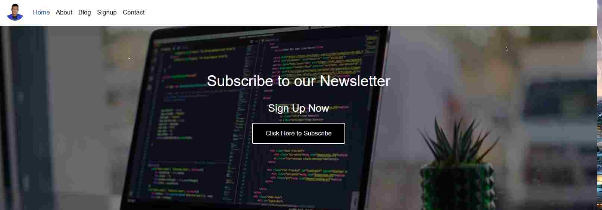

# Modal

## About The Project
This project is about creating a webpage with a modal popup subscription form, A click eventlistener is used to overlay the modal box on the webpage and at the click of the 'X' button the modalbox closes and returns the user tothe initial webpage
 
## Image

## Built With
* CSS
* HTML
* Javascript

## Author
* 👨‍🦱Ezekiel Ogunniwa
  * Github: https://github.com/Eminentzeal
  * linkedin: https://www.linkedin.com/in/ogunniwaezekiel/
  * Twitter: https://twitter.com/Ogunniwaezekiel

## Facilitators
* [Godwin Nwachukwu](https://github.com/Gnwin).

* [Chioma Nwachukwu](https://github.com/Chiomy).

## Acknowledgements
* HomeFrontStartup
  * http://homefrontstartup.com.ng/
* Mentors International
  * https://mentorsint.com/
  * https://www.facebook.com/mentorshubyola/
  * https://twitter.com/hub_mic
  * https://www.linkedin.com/company/michub/

# Live Demo
[Click Here to see project live](https://eminentezekiel-modal.netlify.app/)

## 🤝 Contributions
* This project is open to your comments and contributions, kindly reach the author through the above author's social media handles.

